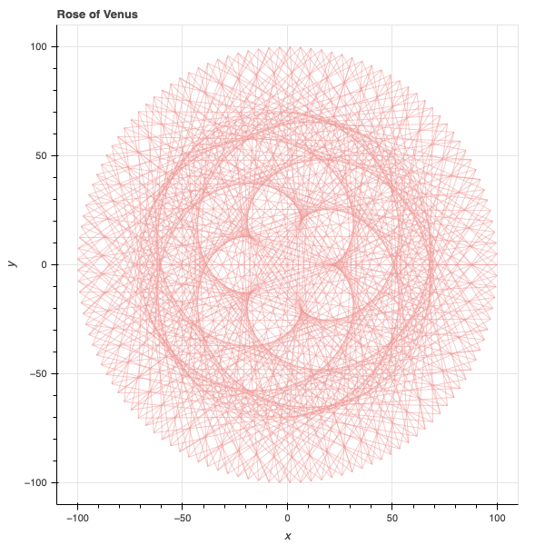
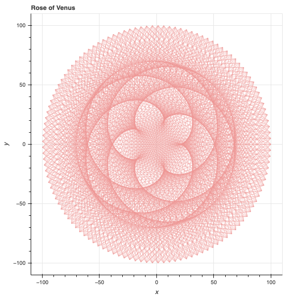
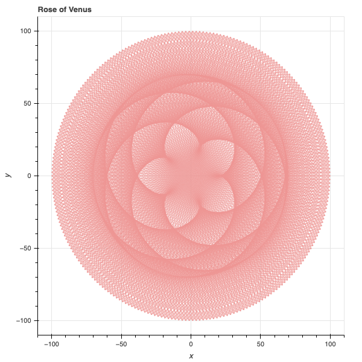
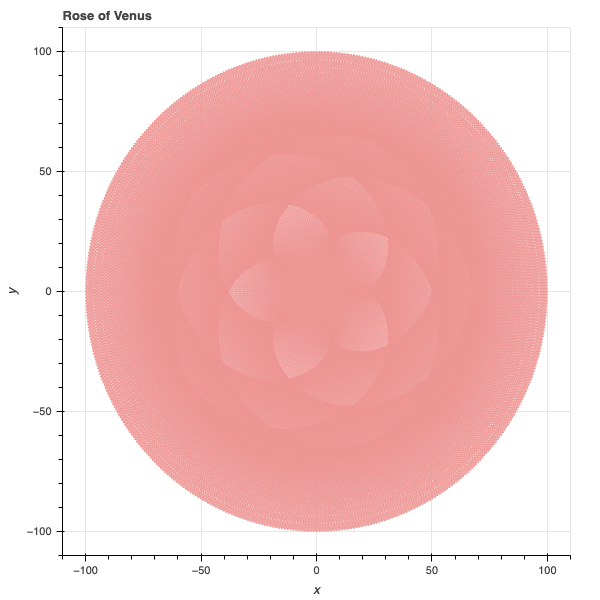

# Rose Plotting

A simple [Bokeh](https://bokeh.org/) based script for generating the rose, inspired by the nature of motion between Earth and Venus

### Setup

```
pip install bokeh
pip install numpy
```

### Run
```
python rose.py
```

### Results

Using different value of num_lines make different pattern

```
num_lines = 500
```


```
num_lines = 1000
```



```
num_lines = 2000
```



```
num_lines = 4000
```



